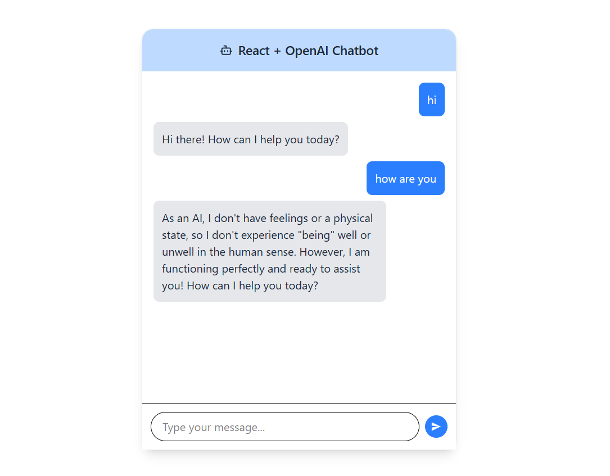

# 🤖 React + Tailwind Chatbot (Gemini AI)

A simple chatbot built with **React + Vite + Tailwind CSS** that connects to **Google Gemini API**.  
It has a clean card UI with:
- Sticky header & input area
- Scrollable chat section
- User & Bot message bubbles
- Copy button on bot responses

---

## 📸 Demo



---

## ⚡ Features

- 🎨 **Modern UI** with TailwindCSS  
- 📌 **Sticky header & footer**, scrollable chat area  
- 💬 **User vs Bot messages** styled differently  
- 📋 **Copy button** on bot responses  
- 🔑 **Environment variables** for API key  
- 🔗 Uses **Google Gemini API** for responses  

---

## 🛠️ Tech Stack

- [React](https://react.dev/) + [Vite](https://vitejs.dev/)  
- [Tailwind CSS](https://tailwindcss.com/)  
- [Google Gemini API](https://ai.google.dev/)  
- [React Icons](https://react-icons.github.io/react-icons/)  

---

## 🚀 Getting Started

### 1️⃣ Clone this repository
```bash
git clone https://github.com/yourusername/react-gemini-chatbot.git
cd react-gemini-chatbot
